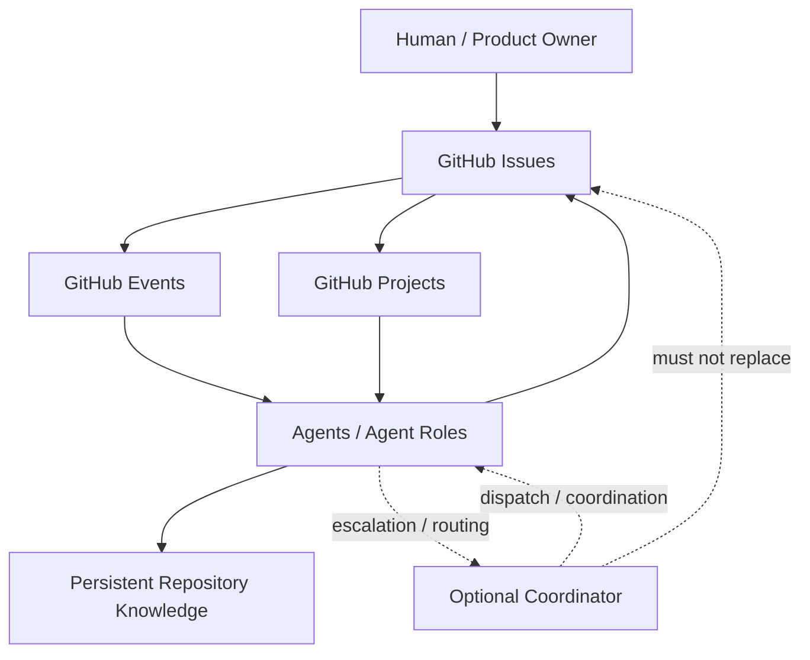

# P3.4 — Agent Workflow Architecture Research

Parent Issue: #14 — Define agent communication protocol
Issue: #57 — Agent workflow architecture combination system planning

## Scope

This document records the P3.4 planning research for the combined Jagports AI OS agent operating model. It is planning only. No production implementation is authorized by this document.

## Search Result Map



The intended control model keeps GitHub Issues as the persistent work and communication record, GitHub Projects as the visual workflow representation, events as activation signals, agents as executing actors, and repository knowledge as durable validated knowledge. A coordinator is optional and must remain subordinate to the GitHub record.

## Architecture Search Comparison

| Architecture | Activation | Persistent record | Response | Complexity | Lock-in risk | P3.4 assessment |
|---|---|---|---|---|---|---|
| Scheduled polling | Agent checks GitHub periodically | GitHub | Periodic / bounded by schedule | Low | Low | Useful fallback and simple baseline |
| GitHub Actions event-driven | GitHub event starts workflow/job | GitHub | Event-driven | Low–medium | Medium | Strong candidate for deterministic automation |
| External webhook/event service | GitHub sends event to external service | GitHub + external runtime | Near event-driven | Medium–high | Medium | Useful when external persistent runtime is justified |
| Coordinator agent | Coordinator discovers/routes work to agents | GitHub + coordinator state if needed | Event/poll driven | High | Higher | Defer until direct routing proves insufficient |
| Hybrid | Events for prompt work + polling for recovery | GitHub | Event-driven with recovery | Medium | Medium | **Preferred preliminary direction** |

### Evidence from GitHub capabilities

GitHub Actions workflows can run from repository events, external `repository_dispatch`, schedules, or manual triggers. GitHub documents workflows as YAML stored in `.github/workflows`. citehttps://docs.github.com/en/actions/concepts/workflows-and-actions/workflows

GitHub webhooks can send HTTP requests to an external server when subscribed GitHub events occur. This provides an alternative event-delivery path when an external runtime is justified. citehttps://docs.github.com/en/webhooks/about-webhooks

GitHub Project items and their fields can be queried and updated through the Projects API/GraphQL model, supporting the required separation between persistent Issue records and Project workflow state. citehttps://docs.github.com/en/issues/planning-and-tracking-with-projects/automating-your-project/using-the-api-to-manage-projects

Scheduled GitHub Actions have a minimum five-minute interval and run from the default branch. GitHub also notes that scheduled workflows can be delayed under high load. This makes scheduling useful for recovery/reconciliation but less suitable as the sole low-latency communication mechanism. citehttps://docs.github.com/en/actions/reference/workflows-and-actions/workflow-syntax

## Combined Operating Model

```text
                    GITHUB — SYSTEM OF RECORD
┌─────────────────────────────────────────────────────────────┐
│ Issues = work + communication + decisions + hand-offs      │
│ Projects = workflow state / Kanban visualization           │
│ PRs = implementation + review + merge traceability         │
└──────────────────────────────┬──────────────────────────────┘
                               │
                  event / scheduled discovery
                               │
                               ▼
                    AGENT EXECUTION LAYER
             ┌─────────────────────────────────┐
             │ Research / Product / Engineering│
             │ Testing / Review-support roles  │
             └────────────────┬────────────────┘
                              │
                 result / acknowledgement
                              │
                              ▼
                    GitHub persistent record
                              │
                  ┌───────────┴───────────┐
                  ▼                       ▼
             Continue work             Escalate
                                          │
                                          ▼
                                   Human decision gate
```

## Preliminary Conclusion

**The preliminary P3.4 recommendation is a hybrid GitHub-centered architecture.**

1. GitHub Issues remain the authoritative persistent communication and work records.
2. GitHub Project Item Status remains the Kanban representation of workflow state.
3. Agents operate as defined roles and execute work against the GitHub records.
4. Event-driven activation should be preferred for prompt deterministic reactions where GitHub Actions or webhooks provide the required capability.
5. Scheduled polling should remain available as a reconciliation/recovery mechanism rather than the sole communication path.
6. A dedicated coordinator agent should **not** be introduced as the first implementation. It should be evaluated only if direct event/poll-to-agent routing proves insufficient in practice.
7. Any coordinator must not become a competing system of record; important state, decisions, hand-offs, acknowledgements and results must remain recoverable from GitHub.
8. The $0 project constraint favors using existing GitHub capabilities before introducing an always-on external coordination service.
9. P3.4 should remain a planning decision until P3.5, P3.6 and P3.7 provide their respective evaluations of polling, event-driven Actions, and coordinator architectures.

This conclusion is therefore **preliminary, not an approval to implement**. The next decision point is to consolidate the sibling research results and, if materially different alternatives remain, present them through the required `PROPOSED → DECISION NEEDED` human decision gate.

## Traceability

- Parent: #14
- Active planning Issue: #57
- Related investigations: #58, #59, #60
- No implementation is included in this P3.4 research change.
