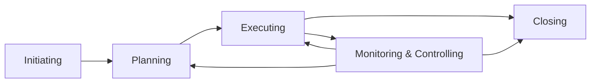
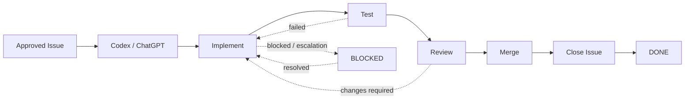
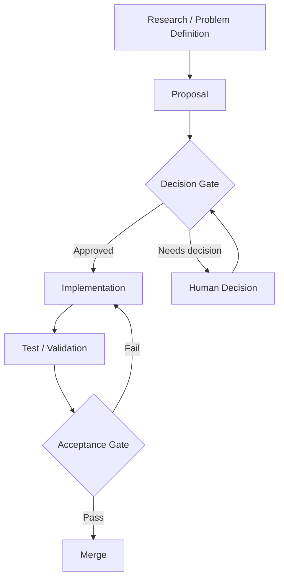
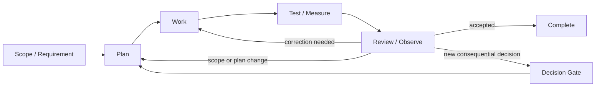
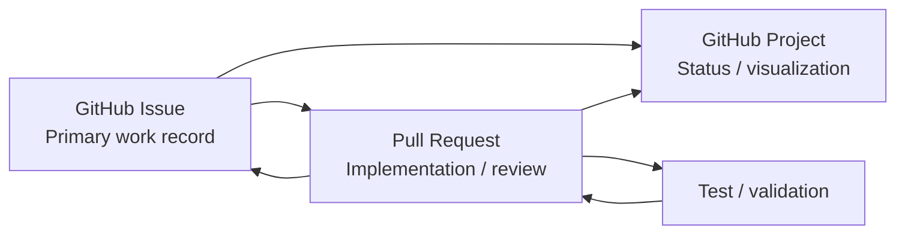

# Jagports Project Knowledge

## Repository and GitHub Access

The authoritative Jagports repository is:

`jagports/jagports`

The GitHub account used for Jagports repository access is:

`jagports-fi`

`jagports-fi` is an administrator of the `jagports/jagports` repository.

Do not use the obsolete `tlindi/jagports` repository reference for current Jagports work.

## Future Agent Operating Model Investigation

Topic: proactive multi-agent workflow architecture

This topic requires further investigation before implementation.

Potential architecture options:

1. Scheduled polling agents
- Agent watcher process runs continuously on an available host.
- Periodically checks GitHub Issues, Projects, comments, assignments and status changes.
- Evaluation criteria:
  - suitability for Jagports
  - response time
  - operating cost
  - vendor lock-in risk
  - simplicity and ease of deployment
  - technical complexity

2. GitHub Actions event-driven agents
- GitHub events trigger workflows.
- Possible triggers:
  - Issue created or updated
  - Issue assigned
  - Issue comment added
  - Pull Request opened or reviewed
  - Repository file changes
- Evaluation criteria:
  - suitability for Jagports
  - response time
  - operating cost
  - vendor lock-in risk
  - simplicity and ease of deployment
  - technical complexity

3. Coordinator Agent architecture
- A coordinator service routes work between specialised agents.
- Possible responsibilities:
  - detect new work
  - assign agents
  - collect acknowledgements
  - monitor progress
  - detect missing responses
  - maintain information flow
- Evaluation criteria:
  - suitability for Jagports
  - response time
  - operating cost
  - vendor lock-in risk
  - simplicity and ease of deployment
  - technical complexity

Important principle:
Important project information must not exist only in private agent context. Decisions, results and reusable knowledge must be persisted into GitHub Issues, documentation, decision logs or knowledge files.

## AI Tool Capability Transparency

When an AI agent is expected to perform an external action, the agent must distinguish user/account authorization from the execution capabilities actually available in the current session.

If an expected action cannot be completed, record and communicate the verified cause where possible, such as:
- required tool operation unavailable
- insufficient permission
- authentication problem
- unavailable integration
- technical failure

Do not claim that an action was completed without verification. Do not repeatedly retry an unsupported operation without explaining the limitation.

For Jagports, an important operational distinction is:
- GitHub account/repository permissions determine what the account is authorized to do.
- The connected agent/tool interface determines which of those operations the agent can actually invoke in a given session.

When capability availability changes or is uncertain, the agent should state the limitation explicitly and identify the available alternative or required next step.

## GitHub Access and Command Execution Lessons

GitHub access must be checked before starting work that depends on GitHub. Repository access alone is not sufficient: the agent must also verify that the specific operation required for the task is available, such as file editing, branch creation, PR creation, Issue comments, or Project field updates.

If required GitHub access or an operation is unavailable, the user must be alerted immediately. The agent must not silently substitute an unperformed action, repeatedly retry an unavailable operation, or unnecessarily make the user execute commands to compensate for the missing agent capability.

When the user explicitly requests commands, provide the requested command sequence in one Markdown code block for easy console pasting. Do not propose creating a script for the user to run when direct commands are sufficient.

For command sequences whose later steps depend on earlier output, use a temporary file in the working directory to carry the required result between commands. Remove those temporary files after the dependent commands have completed successfully.

Windows Git Bash compatibility is an explicit project constraint. Avoid `awk`, Bash associative arrays, backslash (`\\`) line continuations, and Windows path-separator assumptions. Prefer forward-slash paths and simple Git Bash-compatible shell constructs. Commands should be verified against these known limitations before being given to the user.

## GitHub Issue and Pull Request Comment Formatting

GitHub Issue and Pull Request comments must be formatted for quick visual scanning and reliable traceability.

- Put each distinct traceability statement on its own line or paragraph.
- When an Issue or Pull Request is the primary reference for a statement, put its Markdown link at the beginning of the line.
- Keep the Issue/PR number and title together in the link text when useful; do not bury the reference inside a long sentence.
- Separate relationship text such as `implements`, `resolves`, `supersedes`, or `previous implementation` from the referenced Issue or Pull Request instead of placing the complete relationship in one long line.
- Use short headings or labels on their own lines when context is needed before a reference.
- Do not construct long inline chains containing a PR title, PR number, Issue title, Issue number, and relationship text in the same sentence.

Preferred pattern:

**Previous implementation**
[PR #<number> — <title>](<PR URL>)

**Implements/resolves**
[Issue #<number> — <title>](<Issue URL>)

For multiple references, give each primary reference its own line rather than combining them into a single paragraph.

## KNOWLEDGE.md Hierarchy and Generalization Rules

`KNOWLEDGE.md` files may exist at the repository root and within domain-specific subfolders. Each file contains durable, reusable knowledge appropriate to its scope.

- The root `KNOWLEDGE.md` contains cross-domain, repository-wide and organizational knowledge.
- A nested `KNOWLEDGE.md` contains durable knowledge specific to its containing domain or subfolder.
- Further nesting is allowed when a domain becomes sufficiently large to justify a more specific knowledge scope.
- A nested knowledge file must not be deleted merely because it is nested. Consolidate material into the root only when it is genuinely cross-domain.
- The hierarchy policy in this section applies to every `KNOWLEDGE.md` in the repository.
- All `KNOWLEDGE.md` files must contain durable, reusable knowledge rather than chronological task history.
- Generalize observations before recording them as knowledge. Do not preserve individual Issue numbers, PR numbers, branch names, temporary identifiers, one-off test cases, or one-off category examples unless they are necessary to express a reusable principle.
- Task-specific evidence, implementation history and temporary operational details belong in the relevant task record, review, test record, project record, or other task-specific documentation.
- Repository-wide policy should be defined at the root and should not be unnecessarily duplicated in nested knowledge files.
- A nested knowledge file may briefly identify its scope or point to root policy, while its substantive content should remain domain-specific.
- Before committing a `KNOWLEDGE.md` change, review the content for task-specific identifiers and one-off examples and generalize or remove them where appropriate.

## Project Work Plan Reference

`5-Implementation-Projects/Jagports_AI_OS_Prioritized_Work_Plan.md` is maintained as a **WORK IN PROGRESS** planning document.

Agents should consult it when planning project work, but should critically evaluate its descriptions, assumptions and proposed structures. The work plan is not fixed: agents are encouraged to identify inconsistencies, outdated material, missing work, unnecessary complexity and better approaches, and to freely suggest improvements.

The GitHub Issues are the primary work and communication records. The GitHub Project provides a visual representation of Issues and their current Project Item Status.

## Agent Communication Protocol Reference

`0-DocumentationEducationCompetense/AGENT_COMMUNICATION_PROTOCOL.md` defines the detailed communication protocol for agents and humans working on Jagports AI OS.

Agents should consult the protocol when handling Issue communication, acknowledgements, hand-offs, escalations, decisions and implementation traceability. It complements this knowledge file by providing operational communication rules.

## Issue-to-Completion Lifecycle

The standard Issue-driven development lifecycle is:

**Approved Issue → Codex → Implement → Test → Review → Merge → Close Issue → Done**

The previous lifecycle **Approved Issue → Codex → Implement → Test → Review → Merge → Done** is obsolete and must not be used.

Current implementation reality: Codex is not yet integrated into the Jagports development workflow. At present, implementation is primarily driven by ChatGPT under the control and direction of `tlindi`.

The initiating Issue remains open while its implementation is being developed, tested and reviewed. The implementing Pull Request should maintain explicit traceability to the initiating Issue using the project's preferred relationship wording.

After the implementing Pull Request is successfully merged and the work is complete, close the initiating Issue with reason `completed`. The final Project state for the completed work is `DONE`.

Closing the Issue is a lifecycle step after merge; it is not a substitute for PR-to-Issue traceability and does not require the PR relationship itself to use automatic `Closes #N` wording.

## Project Management Workflow Charts

Workflow charts are used to present the process at the level needed by the reader. Keep each chart focused on one purpose rather than combining every Project, Issue, PR, test, decision and operational detail into one diagram.

### General project lifecycle reference

A conventional project-management lifecycle can be represented as five major process groups: initiating, planning, executing, monitoring and controlling, and closing. Monitoring and controlling is not merely a final step; it operates alongside execution and feeds corrective action back into the plan and work.

This is a reference model for presentation, not a replacement for the Jagports workflow. PMI describes the five process groups as Initiating, Planning, Executing, Monitoring and Controlling, and Closing. Microsoft likewise presents a five-phase project lifecycle using initiation, planning, execution, monitoring/control and closure.

### Jagports Issue-to-completion workflow

The authoritative Jagports implementation lifecycle is narrower and more operational than a generic project lifecycle. The Project visualizes the Issue's current workflow state, while the Issue and Pull Request records retain the detailed work and traceability.

Rules represented by this chart:

- The initiating Issue remains open during implementation, testing and review.
- The Pull Request provides explicit traceability to the initiating Issue.
- A successful merge is followed by closing the initiating Issue with reason `completed`.
- The final Project state is `DONE`.
- `BLOCKED` is an exceptional state, not a normal lifecycle stage.
- Test failure or review-requested changes return the work to implementation rather than allowing premature completion.

### Decision and control gates

Project management becomes easier to understand when decision gates are shown separately from the normal work flow. A gate answers whether the work is authorized to proceed; it is not another implementation task.

For Jagports, explicit human approval is required when the work reaches a consequential decision gate defined by the project's communication and decision rules. Routine execution should not be escalated merely because a workflow contains a gate.

### Execution, monitoring and feedback loop

A useful management view separates doing work from observing its result. Feedback can change implementation, testing, planning or the decision that authorized the work.

This feedback-loop view is particularly useful for explaining why `REVIEW`, `TESTING`, `BLOCKED`, and decision/escalation mechanisms are control functions rather than simple linear steps.

### Issue, Project and PR traceability view

The Project is the visual work-control layer. The Issue is the primary persistent work and communication record. The Pull Request is the implementation and review record. These records should remain connected without requiring one diagram to reproduce all their internal details.

The diagram is intentionally conceptual. The exact Project fields, labels, test structure and repository automation belong in the relevant operational knowledge and Issue records.

### Presentation rules for workflow charts

- Use a lifecycle chart to explain the overall sequence.
- Use a decision-gate chart to explain authorization and escalation.
- Use a feedback-loop chart to explain testing, review, correction and control.
- Use a traceability chart to explain which GitHub record owns which kind of information.
- Do not put individual Issue or PR numbers into reusable knowledge charts.
- Do not use an external project-management lifecycle as if it were the Jagports Project Status list.
- Keep `Project Status` and project-management lifecycle concepts distinct: a Project Status describes the current work state, while a lifecycle chart explains how work moves and why transitions occur.

### External workflow references

The following sources were used as reference material for the conceptual charts:

- Project Management Institute, five process groups and project-management lifecycle: https://www.pmi.org/-/media/pmi/documents/public/pdf/certifications/standard-for-portfolio-management-third-edition.pdf
- Project Management Institute, project-management process groups and activities: https://www.pmi.org/learning/library/project-management-middle-five-stages-6969
- Microsoft, project lifecycle visual model: https://www.microsoft.com/en-sg/microsoft-365/business-insights-ideas/resources/how-to-manage-all-five-phases-of-a-projects-life-cycle
- Microsoft Learn, configurable project stages: https://learn.microsoft.com/en-us/dynamics365/project-operations/project-management/project-stages
- Atlassian, workflow diagrams and their use for project planning, dependencies and process improvement: https://www.atlassian.com/agile/project-management/workflow-chart

These references are explanatory sources only. The authoritative Jagports process remains the workflow and rules defined in this repository's `SKILL.md`, `KNOWLEDGE.md`, communication protocol and GitHub Project configuration.
